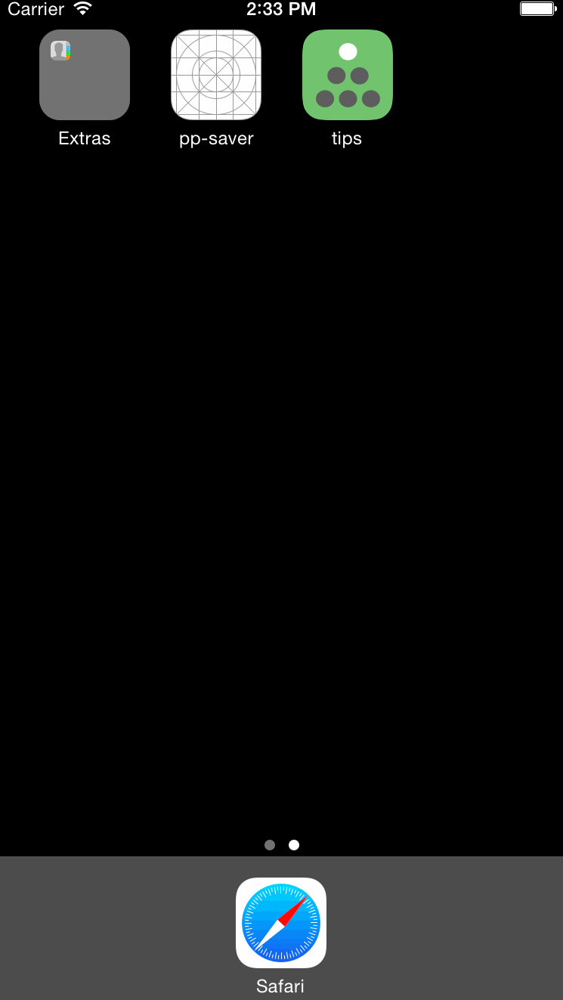

# Tip Calculator 
## Just the Tip

This iPhone app takes a bill’s total amount and calculates the tip the user should leave. The user has three percentage options to choose from when calculating the tip. 

**Time spent:** 

6 hours spent

**Completed user stories:**
 
 * [X] A user may enter a bill amount
 * [X] A user may dismiss the keyboard
 * [X] A user may change the tip percentage

**Notes:**

Optimized for the iPhone 6. 

Includes optional work: 
 * [X] App icon and splash screen
 * [X] Animation of text input 
 * [X] Appearance of tip options when the user starts entering their bill total
 * 
Walkthrough of all user stories:

GIF created with [LiceCap](http://www.cockos.com/licecap/).
